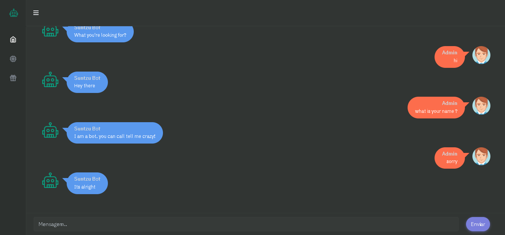

# Django-Suntzu-ChatBot
  
ChatBot simples desenvolvido com Python e o Natural Language Toolkit


## Example


## Usage
```sh
docker-compose up -d --build
```

```sh
docker-compose exec web python manage.py migrate --noinput
```

```sh
docker-compose exec web python manage.py createsuperuser
```
